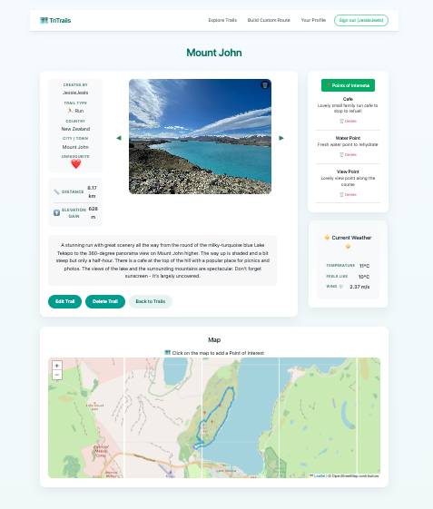
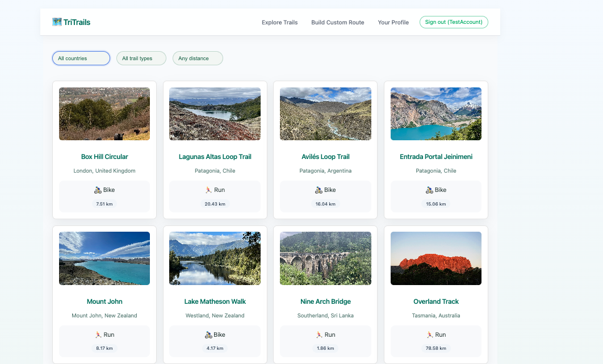
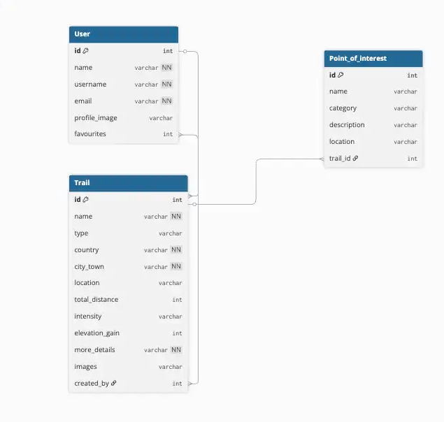
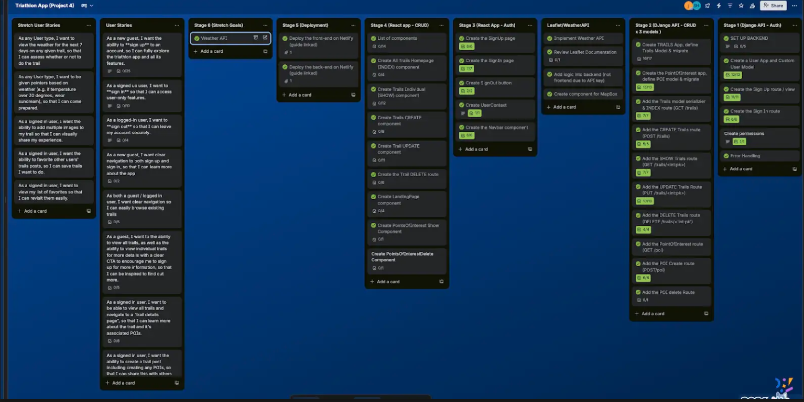

## Triathlete Trails App — React Frontend (Leaflet, GPX, Django API)

## Overview

TriTrails is a full-stack web app designed for triathletes who want to discover and share training routes when travelling or exploring new places. The platform allows athletes to upload GPX files, view routes on interactive maps, add points of interest (such as water stops, viewpoints, or repair shops), and save their favourite trails for future sessions.

I built TriTrails during the final phase of my General Assembly Software Engineering course to solve a real problem I experience as a triathlete - finding safe, reliable swim, bike, and run routes anywhere in the world.

The application consists of a React single-page frontend and a Django REST API backend.




## 📑 Table of Contents

- [Overview](#overview)
- [Deployment](#deployment)
- [Related Repositories](#related-repositories)
- [At A Glance](#at-a-glance)
- [Trails Show & Trails Detail Screenshots](#trails-show--trails-detail-screenshots)
- [Technical Highlights](#technical-highlights)
- [Deployment](#deployment)
- [Getting Started](#getting-started)
  - [Prerequisites](#prerequisites)
  - [Installation](#installation)
  - [Environment Variables](#environment-variables)
- [Timeframe & Working Team](#timeframe--working-team)
- [Technologies Used](#technologies-used)
- [Project Brief](#project-brief)
- [Planning](#planning)
- [Build / Code Process](#build--code-process)
- [Challenges](#challenges)
- [Wins](#wins)
- [Key Learnings](#key-learnings)
- [Bugs / Known Limitations](#bugs--known-limitations)
- [Future Improvements](#future-improvements)


## Deployment

Live site: https://triathleteappreactfrontend.netlify.app


## Related Repositories

Note: This README covers the React frontend. The Django REST API backend is documented in a separate repository:
Backend API: https://github.com/JessJeats22/triathlete_app_django_backend

## At A Glance

- Single-page React frontend (Vite)
- Django REST API backend (separate repo)
- Leaflet maps with GPX overlays + POIs
- Cloudinary image + GPX storage
- Weather integration via backend endpoint
- Auth, favourites, and protected routes


## Technical Highlights

- Optimistic UI updates for trail favourites, with rollback on API failure.
- Leaflet map rendering with GPX route overlays and interactive Points of Interest.
- Cloudinary integration for image uploads and raw GPX file storage.
- Service-based API layer using Axios with automatic auth-token injection.
- Role-aware UI — trail owners can edit, delete, and manage POIs.
- Consistent loading and error-handling patterns across asynchronous views.
- Route-based navigation and protected pages implemented with React Router.


## Getting Started

Follow the steps below to run the frontend locally. This project requires a running instance of the Django REST API backend (either locally or deployed).

### Prerequisites

Node.js v18+
npm (or yarn)
Django backend API available at the URL you configure

### Installation

```bash
git clone https://github.com/JessJeats22/triathlete_app_react_frontend.git
cd triathlete_app_react_frontend
npm install
```

### Environment Variables

Create a .env in the project root:

```bash
VITE_API_URL=http://localhost:8000/api
VITE_OPENWEATHER_API_KEY=your-api-key
VITE_CLOUDINARY_URL=your-cloudinary-image-endpoint
VITE_CLOUDINARY_RAW_URL=your-cloudinary-raw-endpoint
VITE_UPLOAD_PRESET=your-image-upload-preset
VITE_RAW_UPLOAD_PRESET=your-raw-upload-preset
```

### Backend Repository

This frontend consumes the Django API from the companion backend project:
https://github.com/JessJeats22/triathlete_app_django_backend


### Run the Application

Make sure your Django backend is running, then start the frontend:

``` bash 
npm run dev
```

The application will be available at:
http://localhost:5173


## Timeframe & Working Team

This was a solo project completed over a 7-day sprint.
I was responsible for planning, UI implementation, API integration, testing and deployment.

## Technologies Used

- **Frontend:** React, React Router, JavaScript (ES6+), Axios, Leaflet, Vite  
- **Backend (API):** Django, Django REST Framework  
- **External Services:** Cloudinary, OpenWeather API  
- **Development & Deployment:** Git, GitHub, Netlify, Node.js, VS Code


## Project Brief

This project was completed as part of the General Assembly Software Engineering Immersive. The goal was to design and build a full-stack application with:

- A Django REST API and PostgreSQL database  
- A separate React frontend consuming the API  
- Relational data models with full CRUD functionality  
- Public deployment of both the frontend and backend

The project emphasised:

- Code quality and maintainability  
- Thoughtful, user-centred design  
- Realistic feature prioritisation  
- Professional workflows and frequent commits


## Planning

- **Wireframes (Miro):**  
  Low-fidelity screens were created to explore layout options and user flow.  
  https://miro.com/app/board/uXjVJnf3aVk=/?share_link_id=386227732684

- **ERD — Data Modelling:**  
  Entity-relationship diagrams defined relationships between users, trails, favourites, and POIs.  
  

- **User Stories & Sprint Planning (Trello):**  
  MVP features were prioritised and grouped into functional areas to guide delivery.  
   


## Build / Code Process

1️⃣ Authentication & API Service Layer

I structured authentication so that API concerns were separated from UI behaviour. A small Axios-based auth service handles requests, while UserContext stores user state globally, keeping Sign-In and Sign-Up components simple.

```bash 
// services/auth.js
import axios from 'axios'
import { getToken } from '../utils/token'

const api = axios.create({
  baseURL: `${import.meta.env.VITE_API_URL}/auth/`
})

export const signInService = (data) => api.post('/sign-in/', data)
export const signUpService = (data) => api.post('/sign-up/', data)

export const getMyProfile = () =>
  api.get('me/', {
    headers: { Authorization: `Bearer ${getToken()}` }
  })
```

Context exposes the authenticated user and sign-out behaviour:

```bash 
// contexts/UserContext.jsx
import { createContext, useState } from 'react'
import { getUserFromToken, removeToken } from '../utils/token'

export const UserContext = createContext()

export const UserProvider = ({ children }) => {
  const [user, setUser] = useState(getUserFromToken())

  const signOut = () => {
    removeToken()
    setUser(null)
  }

  return (
    <UserContext.Provider value={{ user, setUser, signOut }}>
      {children}
    </UserContext.Provider>
  )
}
```


This kept the UI lightweight and easy to maintain within the project timeframe.

2️⃣ Image Uploads with Cloudinary

To allow users to attach images to trails without complicating the form logic, I built a reusable upload component that sends files to Cloudinary and returns the hosted URL to the parent form.

```bash
// components/ImageUploadField.jsx
import { uploadImage } from '../../services/cloudinary'

export default function ImageUploadField({ setImage, imageURL }) {
  const handleUpload = async (e) => {
    const file = e.target.files[0]
    const { data } = await uploadImage(file)
    setImage(data.secure_url)
  }

  return (
    <>
      {imageURL && }
      <input type="file" accept="image/*" onChange={handleUpload} />
    </>
  )
}
```

Upload logic stays isolated inside a service module:

```bash
// services/cloudinary.js
import axios from 'axios'

export const uploadImage = (file) =>
  axios.postForm(import.meta.env.VITE_CLOUDINARY_URL, {
    file,
    upload_preset: import.meta.env.VITE_UPLOAD_PRESET
  })
  ```


This gave a clean separation between upload behaviour and form state.

3️⃣ Leaflet Map & Points of Interest

The map allows users to drop and manage POIs directly on the route.
Data is fetched and stored locally via a simple service layer.

```bash
// services/pois.js
import axios from 'axios'
import { getToken } from '../utils/token'

const api = axios.create({
  baseURL: `${import.meta.env.VITE_API_URL}/poi/`
})

export const poisForTrail = (trailId) =>
  api.get(`trails/${trailId}/pois/`, {
    headers: { Authorization: `Bearer ${getToken()}` }
  })

export const createPoiForTrail = (trailId, poi) =>
  api.post(`trails/${trailId}/pois/`, poi, {
    headers: { Authorization: `Bearer ${getToken()}` }
  })
  ```


The UI re-fetches after creation so the sidebar and map stay in sync.

I chose to keep creation + deletion inside one component for clarity within the 7-day timeframe, noting it as a future refactor opportunity.

4️⃣ Trail-Specific Weather via Backend Integration

To support real-world training use, the trail page displays live weather. All third-party API calls are proxied through the backend so API keys are never exposed in the frontend.

```bash
// services/weather.js
import axios from 'axios'
import { getToken } from '../utils/token'

export const getTrailWeather = (trailId) =>
  axios.get(`${import.meta.env.VITE_API_URL}/trails/${trailId}/weather/`, {
    headers: { Authorization: `Bearer ${getToken()}` }
  })
```

The frontend focuses only on state and presentation, keeping the implementation simple and secure.

## Key Learnings

- Developed strong confidence working with Django, DRF, and relational data modelling.
- Improved understanding of data flow across the database → API → frontend pipeline.
- Became more intentional about designing reusable, maintainable components.
- Strengthened debugging, prioritisation, and decision-making under time constraints.
- Learned to use AI as a research and problem-solving tool rather than a replacement for understanding.

## Challenges

- Learning Django and Django REST Framework while delivering a full project within a 7-day sprint.
- Maintaining consistent naming conventions and structure as the codebase grew.
- Managing asynchronous behaviour and implementing optimistic UI updates reliably.
- Making pragmatic trade-offs to prioritise a stable MVP over unnecessary complexity.

## Wins

- Built meaningful features beyond basic CRUD, including GPX upload, mapping, POIs, and weather integration.
- Achieved clear separation of concerns via service modules, context state, and reusable components.
- Successfully integrated mapping, uploads, and API data into a cohesive, user-friendly experience.
- Added thoughtful UX details such as optimistic favourites and image upload previews.
- Delivered a full-stack project independently within the sprint window.

## Bugs / Known Limitations

- Upload failures are currently logged to the console rather than surfaced in the UI.
- Favourite rollback behaviour works, but lacks clear user-visible feedback.
- POI creation requires clicking the map first, which could be clearer from a UX perspective.

## Future Improvements

- Introduce a richer homepage and stronger visual design (potentially using Tailwind or a component library).
- Expand the profile area with editable details and training statistics.
- Enhance POI interactions with editing, filtering, clustering, and improved UI patterns.
- Provide clearer inline feedback for errors, uploads, and
